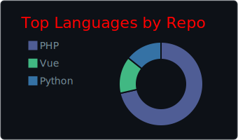

  

  

  

## About
- Full-stack developer focused on clean, reliable web products.
- Previously built, tested, and ran aerospace propulsion systems; now I bring that same systems rigor into software.
- Strong in modern UI work with `Vue`, `Vite`, `TypeScript`, and `JavaScript`.
- Comfortable building backend features with `PHP`, `WordPress`, `MySQL`, and `PostgreSQL`.
- Linux-first workflow with Git-based delivery.

## Tech Stack

  

## Current Focus
- Building fast, maintainable front ends.
- Improving API and database design discipline.
- Making steady progress with tighter DevOps habits.

## Featured Projects
| Project | Summary |
| --- | --- |
| [OnLedge](https://github.com/agillhock7/OnLedge) | Snap receipts, stay organized, and see where your money goes. |
| [EveryMile](https://github.com/agillhock7/EveryMile) | Track movement, true operating cost, and deduction value in one defensible stream. |
| [MySite](https://github.com/agillhock7/MySite) | A beginning look at personalized UI with AI. |
| [Slapshot-Snapshot](https://github.com/agillhock7/Slapshot-Snapshot) | Team photos and videos. |
| [parcel-tracker](https://github.com/agillhock7/parcel-tracker) | Secure shipment tracking across desktop and mobile. |
| [feedabum](https://github.com/agillhock7/feedabum) | Hyperlocal micro-giving for verified neighbors; scan, verify, and donate in under a minute. |

## GitHub Snapshot

  
  

  

  

  

